# FGF Digital Ticketing & Stadium Access Platform
## Product Requirements, Industry Benchmark, System Architecture & Implementation Blueprint

**Document:** FGF Digital Ticketing & Stadium Access Platform — Engineering Blueprint  
**Version:** 1.0  
**Status:** Proposed Architecture / Pre-Implementation Baseline  
**Primary language of this document:** English  
**Source specification:** Fédération Guinéenne de Football (FGF) digital ticketing specification  
**Architecture posture:** API-first, open-source-first, modular monolith, production-oriented

---

## 0. Executive Summary

The FGF project is not merely a QR-code ticketing website. It is a complete stadium ticketing and access-control platform covering:

- competitions and matches
- stadium/seat configuration
- ticket inventory
- pricing and quotas
- customer checkout
- payment integration
- ticket issuance
- secure mobile tickets
- QR/dynamic credentials
- gate scanning
- online and offline validation
- ticket redemption
- transfers
- refunds/cancellations
- financial reconciliation
- auditability
- dashboards and reporting
- role-based administration
- multi-stadium expansion
- operational support

The source specification explicitly defines the lifecycle as:

`Match creation → stadium configuration → categories/pricing → sales → payment → ticket issuance → access control → attendance → revenue → reporting/audit`

and requires the platform to be usable across different stadiums and competitions.

The recommended implementation is:

**Modular monolith + PostgreSQL + FastAPI + Next.js + Flutter scanner + Keycloak + Redis + Celery + OpenTelemetry + Prometheus/Grafana/Loki/Tempo + containerized deployment.**

The design deliberately avoids premature microservices and Kubernetes. The objective is to maximize reliability, maintainability and solo-developer productivity while preserving clear module boundaries so components can later be extracted if scale requires it.

---

# 1. Source Requirements Baseline

## 1.1 Business objective

FGF wants a federation-owned digital ticketing platform that progressively replaces manual/physical processes and addresses:

- counterfeit tickets
- ticket duplication
- photocopy/reproduction
- fraudulent resale
- multiple use of one ticket
- revenue diversion
- lack of sales traceability
- difficulty monitoring stadium entry
- reconciliation errors

The source specification also requires the platform to remain owned and controllable by FGF, including source code/documentation under the contractual arrangement.

## 1.2 Business scope

The platform shall support:

1. National-team matches
2. National competitions
3. International matches
4. Qualification matches
5. Other FGF-authorized sporting events
6. Multiple stadiums
7. Multiple ticket categories
8. General admission
9. Numbered seating
10. VIP/VVIP/protocol/partner/press/staff tickets
11. Physical points of sale connected to the central system
12. Future mobile applications
13. Future integrations with accounting and partner systems

---

# 2. Stakeholders

| Stakeholder | Primary needs |
|---|---|
| FGF Executive | Ownership, transparency, revenue, strategic control |
| Ticketing Administration | Match/ticket configuration and sales |
| Competition Manager | Match lifecycle |
| Stadium Manager | Zones, gates, capacity, access |
| Finance | Payments, reconciliation, revenue |
| Gate Supervisor | Live entry monitoring |
| Gate Agent | Fast, reliable scan decisions |
| Auditor | Immutable traceability |
| Customer | Simple purchase and reliable entry |
| Payment Provider | Correct payment/webhook integration |
| Hardware Provider | Scanner/device compatibility |
| Security Auditor | Independent verification |
| DevOps/Infrastructure | Availability, backup, recovery |
| Legal/Compliance | Data protection, contracts, payment obligations |

---

# 3. User-Level Flow

## 3.1 Customer purchase flow

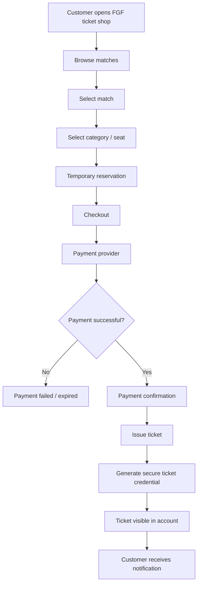

### Customer experience requirements

- Mobile-first
- Low-bandwidth friendly
- Clear price and seat information
- Clear payment state
- No ticket issuance before payment is confirmed
- Ticket remains accessible before match day
- Ticket can be displayed without continuous Internet once provisioned
- Clear transfer/refund status
- Support mechanism for failed payment/ticket problems

---

# 4. User-Level Match-Day Flow

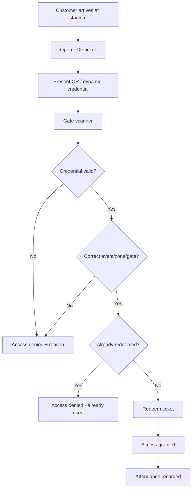

---

# 5. Business-Level Flow

## 5.1 Complete business lifecycle

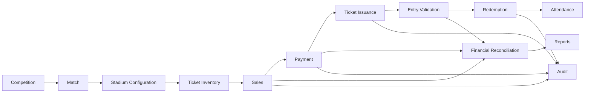

## 5.2 Business domains

### Domain A — Event Management
- competitions
- matches
- teams
- dates
- venues
- publication state

### Domain B — Venue Management
- stadium
- tribunes
- sectors
- blocks
- rows
- seats
- gates
- access zones
- restricted areas

### Domain C — Ticket Inventory
- categories
- prices
- quotas
- seat allocation
- holds
- reservations
- availability

### Domain D — Commerce
- cart/order
- customer
- payment
- refunds
- commissions
- fees

### Domain E — Ticket Identity
- ticket ID
- signed credential
- dynamic token
- ownership
- transfer
- lifecycle

### Domain F — Access Control
- scanner device
- gate
- zone
- check-in
- redemption
- offline synchronization

### Domain G — Finance
- payment reconciliation
- settlement
- refunds
- revenue
- exports

### Domain H — Governance
- users
- roles
- permissions
- audit
- security
- operational monitoring

---

# 6. Functional Requirements

## FR-001 Competition Management

The platform shall allow authorized users to create, modify, publish and manage competitions.

## FR-002 Match Management

Each match shall support:

- competition
- home team
- away team
- date
- time
- stadium
- capacity
- ticket categories
- prices
- quotas
- sales windows
- buyer limits
- special conditions

## FR-003 Stadium Management

The platform shall support:

- stadiums
- tribunes
- sections
- blocks
- rows
- numbered seats
- gates
- VIP
- VVIP
- partners
- officials
- press
- restricted areas

It shall support both:

- general admission
- assigned seating

## FR-004 Ticket Sales

Customers shall be able to:

1. choose a match
2. choose category/seat
3. provide required information
4. pay
5. receive confirmation
6. receive an electronic ticket

## FR-005 Payment

The platform shall integrate approved payment methods available to FGF, including appropriate card, mobile-money and banking integrations.

The architecture shall isolate provider-specific code behind a payment-provider abstraction.

## FR-006 Ticket Security

Every ticket shall have:

- unique internal identity
- cryptographically protected credential
- server-side state
- event association
- category/zone association
- payment relationship
- redemption state

Sensitive personal data shall not be embedded directly in the QR credential.

## FR-007 Ticket Redemption

The system shall support:

- valid ticket
- invalid ticket
- cancelled ticket
- refunded ticket
- already-used ticket
- wrong event
- wrong zone/gate
- revoked credential

## FR-008 Offline Validation

The scanner application shall support temporary offline operation subject to explicit security guarantees.

The offline model shall be documented separately because global single-use guarantees cannot be identical to an always-online atomic database transaction.

## FR-009 User and Access Management

Roles shall be configurable and include at least:

- FGF super administrator
- ticketing administrator
- financial administrator
- competition manager
- stadium manager
- gate supervisor
- gate agent
- point-of-sale operator
- partner/operator
- auditor

Sensitive administrative roles shall support MFA.

## FR-010 Audit

Sensitive operations shall generate audit records.

Examples:

- ticket creation
- ticket modification
- cancellation
- refund
- price changes
- configuration changes
- sale
- scan
- fraud attempt
- user creation
- permission changes
- administrator login

## FR-011 Reporting

The dashboard shall support:

- tickets available
- tickets sold
- revenue
- free tickets
- VIP/VVIP
- cancellations
- refunds
- spectators entered
- occupancy
- sales by category
- sales by channel
- sales by POS
- sales by payment method

## FR-012 Financial Reconciliation

The system shall reconcile:

`generated tickets ↔ sold tickets ↔ payments ↔ cancellations ↔ refunds ↔ redeemed tickets ↔ revenue`

## FR-013 Ticket Transfer

If enabled:

- transfer must occur through the platform
- original holder loses access
- new holder receives a valid credential
- transfer is audited
- copied credentials outside the platform do not transfer ownership

## FR-014 Physical POS

Authorized points of sale shall use the same central inventory/payment/ticket platform.

## FR-015 APIs

Secure APIs shall support:

- web
- mobile applications
- payment systems
- accounting systems
- partners
- future sports platforms

---

# 7. Non-Functional Requirements

## NFR-001 Reliability

Ticket redemption must be strongly consistent when online.

## NFR-002 Availability

Production SLA must be contractually defined before launch.

## NFR-003 Performance

Recommended initial engineering targets:

- normal API P95: < 300 ms where external dependencies are excluded
- normal API P99: < 1 s where practical
- scanner online decision: target < 1 s
- database operations: measured and load-tested
- match-day load: defined through capacity testing

These are engineering targets, not contractual guarantees until validated.

## NFR-004 Scalability

The system must scale horizontally at the application layer.

## NFR-005 Security

Security architecture shall follow:

- OWASP ASVS
- OWASP API Security guidance
- OWASP MASVS principles for mobile
- secure secrets management
- least privilege
- threat modelling
- independent penetration testing

## NFR-006 Recovery

Define:

- RPO
- RTO
- backup frequency
- retention
- restoration procedure
- disaster recovery procedure

## NFR-007 Observability

All production components must provide:

- structured logs
- metrics
- traces
- health checks
- alerts

## NFR-008 Maintainability

Business logic must remain separated into domain modules.

## NFR-009 Vendor Independence

The core platform should minimize proprietary dependencies.

---

# 8. Ticket State Machine

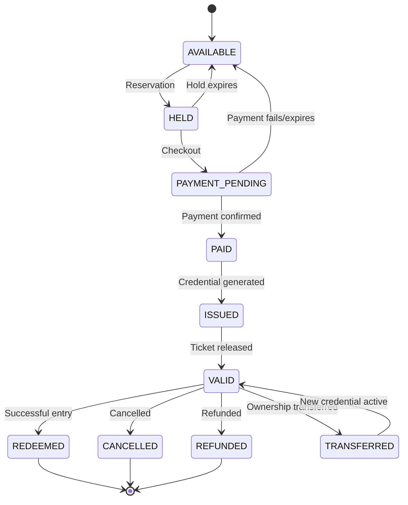

---

# 9. Payment State Machine

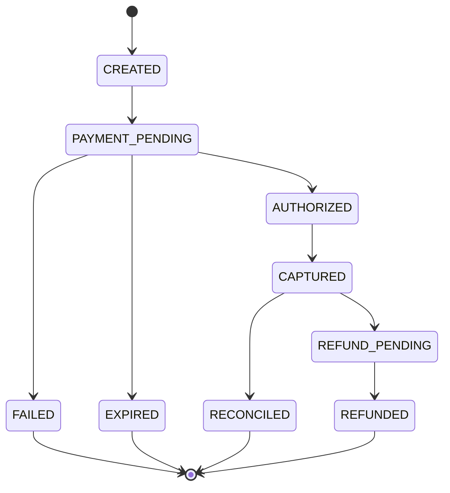

Payment webhooks must be idempotent.

Repeated webhook delivery must not issue multiple tickets.

---

# 10. Redemption State Machine

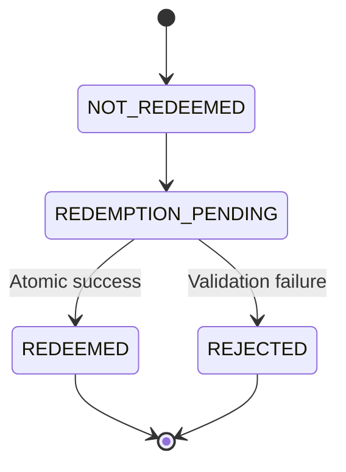

---

# 11. Ticket Security Architecture

## 11.1 Principle

The QR code is not the security system.

The QR code is a **credential carrier**.

Security comes from:

1. cryptographic authenticity
2. server-side ticket state
3. event binding
4. gate/zone rules
5. redemption state
6. device identity
7. transfer controls
8. audit
9. short-lived/dynamic credentials where appropriate

## 11.2 Recommended credential architecture

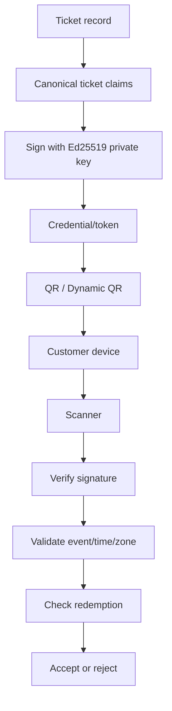

The scanner should not require access to the signing private key.

---

# 12. Industry Benchmark Findings

## 12.1 Ticketmaster SafeTix

Ticketmaster's SafeTix model uses encrypted rotating barcode credentials. Ticketmaster states that its mobile barcode refreshes periodically and that the changing barcode is designed to reduce fraud/counterfeiting.

Its developer documentation also separates the underlying barcode identity from the refreshed secure token and uses a device identifier as part of its security model.

### Design lessons for FGF

Adopt:

- rotating credentials for appropriate mobile tickets
- device/app identity
- server-generated secure token
- credential refresh
- ticket account binding

Do not copy proprietary Ticketmaster implementation details.

---

## 12.2 AXS Mobile ID

AXS uses a revolving QR code that changes periodically. Its documentation states that screenshots/printing are not supported for its Mobile ID flow and that tickets are displayed through its app.

### Design lessons

Adopt:

- dynamic mobile credential
- app-based ticket presentation
- optional ticket transfer
- pre-event ticket availability
- event-day ticket access without requiring continuous Wi-Fi

---

## 12.3 UEFA Mobile Tickets

UEFA's mobile-ticket flow requires users to access tickets through its dedicated app and provides event-day instructions around device readiness and local time.

### Design lessons

Adopt:

- dedicated ticket wallet experience
- pre-event provisioning
- strong device readiness guidance
- event-specific ticket access
- clear match-day UX

---

# 13. Open-Source Benchmark: pretix

pretix is particularly useful as an architectural reference because it is an open-source ticketing platform with:

- event management
- ticket sales
- REST API
- device authentication
- check-in
- offline scanning
- permissions
- idempotency concepts
- self-hosting

Its API documentation includes a dedicated check-in redemption endpoint and device authentication flow.

### Important patterns worth adopting

#### Device identity

Each scanner should have:

```text
device_id
device_public_key
assigned_gate
assigned_event(s)
app_version
status
last_seen
```

A device should be explicitly enrolled rather than behaving like a generic API client.

#### Device-scoped permissions

A scanner should only be able to:

- access assigned events
- validate assigned ticket types
- submit scans
- synchronize its own scan journal

It should never have administrator privileges.

#### Scan idempotency

Every scan should carry a unique scan identifier/nonce so that retransmission does not create duplicate redemption records.

#### Offline journal

Offline scans should be recorded locally and synchronized later.

---

# 14. Open-Source Benchmark: Eventyay

Eventyay demonstrates a useful open-source architecture pattern:

- unified event model
- organizer/admin interface
- public ticket shop
- API
- permissions
- payment services
- logging/audit
- caching
- asynchronous workers

Its current architecture is a unified application rather than a collection of independent ticketing microservices.

### Design lesson

This supports our choice of a:

**Modular Monolith**

rather than starting with microservices.

---

# 15. Industry Pattern Comparison

| Pattern | Industry examples | FGF decision |
|---|---|---|
| Rotating mobile credential | Ticketmaster, AXS, NFL ecosystem | Adopt |
| App-based ticket wallet | UEFA, AXS, Ticketmaster | Adopt |
| Device identity | Ticketmaster, pretix-style device auth | Adopt |
| Server-side redemption | Ticketing platforms | Mandatory |
| Offline scan journal | pretix-style architecture | Adopt |
| Device-scoped permissions | pretix | Adopt |
| Ticket transfer | AXS/major platforms | Adopt in Phase 2 |
| Static printable ticket | Traditional systems | Support only where operationally required |
| Dynamic QR | Major mobile ticket systems | Preferred |
| Unified event model | Eventyay/pretix | Adopt |
| Modular monolith | Eventyay-style architecture | Adopt |
| Kafka from day one | Not required | Reject initially |
| Kubernetes from day one | Not required | Reject initially |

---

# 16. Proposed System Architecture

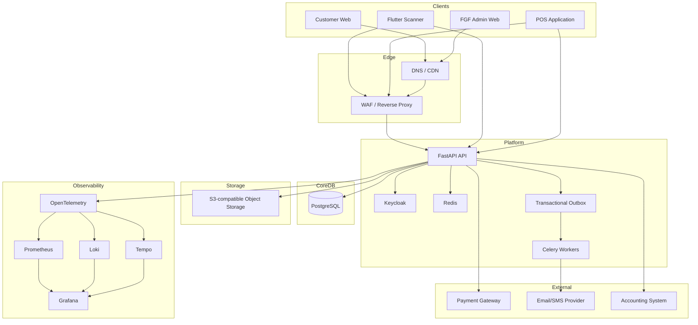

---

# 17. Recommended Technology Stack

## Backend

- Python
- FastAPI
- Pydantic
- SQLAlchemy 2.x
- Alembic
- asyncpg

## Database

- PostgreSQL

PostgreSQL is the source of truth for transactional state.

## Identity

- Keycloak
- OpenID Connect
- OAuth 2.0
- RBAC
- MFA for sensitive roles

## Frontend

- Next.js
- TypeScript
- Tailwind CSS
- shadcn/ui
- TanStack Query
- React Hook Form
- Zod

## Scanner

- Flutter
- Dart
- SQLite

## Async processing

- Celery
- Redis

## Cryptography

- Ed25519 signatures
- platform-supported cryptographic libraries
- KMS/HSM-backed private keys in production

## Storage

- S3-compatible storage
- MinIO where self-hosted object storage is appropriate

## Observability

- OpenTelemetry
- Prometheus
- Grafana
- Loki
- Tempo

## Infrastructure

- Linux
- Docker/OCI
- Caddy or Nginx
- OpenTofu
- GitHub Actions

## Testing

- Pytest
- Playwright
- Schemathesis
- k6
- Flutter unit/integration tests
- OWASP ZAP
- independent penetration testing

---

# 18. Why Modular Monolith?

The platform should start as:

```text
                    API
                     |
        ┌────────────┼────────────┐
        |            |            |
    Identity      Commerce      Ticketing
        |            |            |
    Stadium       Payments     Redemption
        |            |            |
        └────────────┼────────────┘
                     |
                 PostgreSQL
```

Internally these are strict modules.

They are not necessarily separate deployments.

### Advantages

- much easier for a solo developer
- one transactional database
- simpler debugging
- fewer network failures
- easier deployment
- easier local development
- simpler testing
- lower infrastructure cost
- clear future extraction boundaries

### Extract later if needed

Potential future services:

- payment service
- ticket/redemption service
- notification service
- analytics service
- scanner synchronization service

Only extract them when actual scale or organizational boundaries justify it.

---

# 19. Repository Structure

```text
fgf-ticketing/
│
├── apps/
│   ├── api/
│   ├── worker/
│   ├── web/
│   └── scanner/
│
├── backend/
│   ├── identity/
│   ├── competitions/
│   ├── matches/
│   ├── stadiums/
│   ├── inventory/
│   ├── orders/
│   ├── payments/
│   ├── tickets/
│   ├── redemption/
│   ├── transfers/
│   ├── audit/
│   ├── reporting/
│   └── notifications/
│
├── infrastructure/
│   ├── docker/
│   ├── opentofu/
│   ├── monitoring/
│   └── reverse-proxy/
│
├── docs/
│   ├── requirements/
│   ├── architecture/
│   ├── security/
│   ├── api/
│   ├── operations/
│   ├── offline/
│   └── adr/
│
└── tests/
    ├── unit/
    ├── integration/
    ├── contract/
    ├── performance/
    └── security/
```

---

# 20. Database High-Level Model

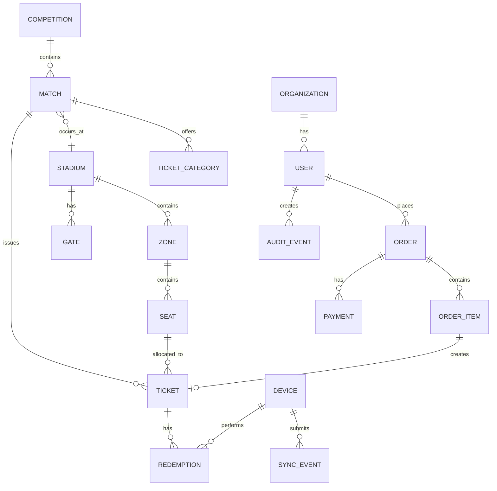

---

# 21. Core Database Entities

Minimum initial entities:

### Identity

- users
- roles
- permissions
- user_roles
- devices
- device_permissions

### Event

- competitions
- teams
- matches

### Venue

- stadiums
- zones
- blocks
- rows
- seats
- gates
- gate_zones

### Commerce

- customers
- orders
- order_items
- payments
- refunds
- payment_events

### Tickets

- tickets
- ticket_credentials
- ticket_transfers
- ticket_status_history

### Access

- redemption_attempts
- redemptions
- scanner_devices
- offline_scan_events
- synchronization_batches

### Governance

- audit_events
- security_events
- system_events

### Reporting

Reports should primarily be generated from transactional records or dedicated read models; avoid maintaining manually edited financial totals.

---

# 22. Payment Architecture

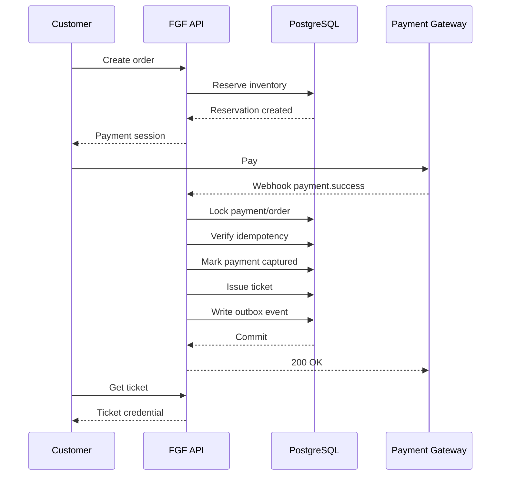

### Critical rule

**No payment confirmation = no paid ticket.**

---

# 23. Inventory Concurrency

Seat inventory is a high-risk concurrency area.

Example:

```text
Customer A ──┐
             ├──> Seat A12
Customer B ──┘
```

Only one reservation may win.

Use PostgreSQL transactional locking/constraints.

Reservation flow:

```text
SELECT seat FOR UPDATE
        ↓
check availability
        ↓
create hold
        ↓
commit
```

Do not rely solely on Redis for inventory correctness.

PostgreSQL remains the source of truth.

---

# 24. Online Redemption

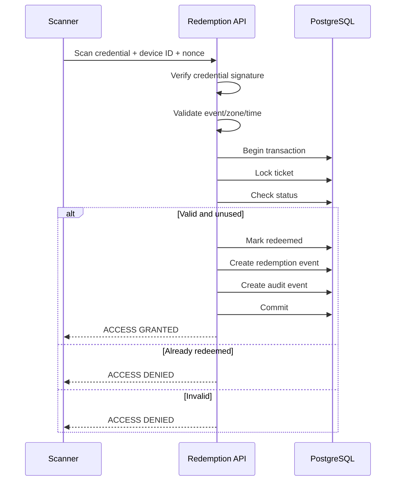

---

# 25. Offline Scanner Architecture

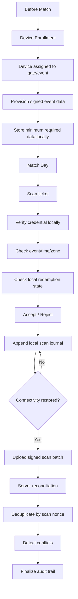

---

# 26. Offline Security Model

Offline operation must explicitly define:

### Credential validity

Can the device verify the credential without the server?

**Yes.**

Use asymmetric digital signatures.

### Ticket state

Can the device know whether another device has already redeemed the ticket?

**Not universally while disconnected.**

Therefore the architecture must define an operational policy.

Possible approaches:

1. Prefer online validation.
2. Pre-provision event-specific credentials.
3. Use short validity windows.
4. Bind credentials to authorized devices/accounts where appropriate.
5. Minimize the duration of disconnected operation.
6. Synchronize frequently.
7. Detect conflicts after reconnection.
8. Establish operational procedures for conflict resolution.

This limitation must be disclosed in the security and acceptance documentation.

---

# 27. Device Security

Each scanner should have:

```text
device_id
device_keypair
event_assignment
gate_assignment
device_status
app_version
last_sync
last_seen
```

Device lifecycle:

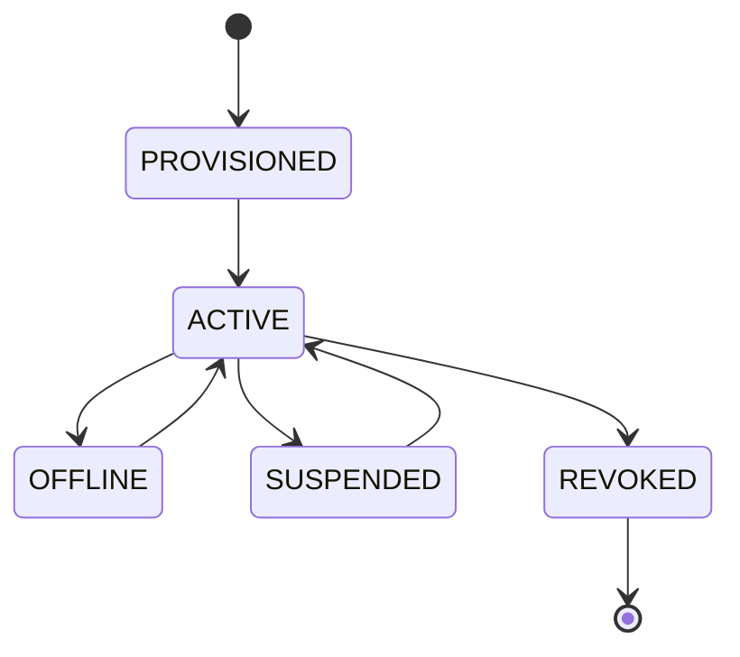

A lost/stolen scanner must be remotely revocable.

---

# 28. Dynamic Ticket Strategy

Use two credential modes.

## Mode A — Static signed credential

Useful for:

- controlled pilot
- printable tickets
- operational fallback
- low-risk event configurations

## Mode B — Dynamic mobile credential

Preferred for:

- high-value matches
- anti-screenshot requirements
- account-bound mobile tickets
- transfer-enabled tickets

Architecture:

```text
Ticket ID remains stable
        |
        v
Short-lived signed display token changes
        |
        v
QR changes periodically
```

The stable ticket identity should not be treated as the rotating secret.

---

# 29. Ticket Transfer

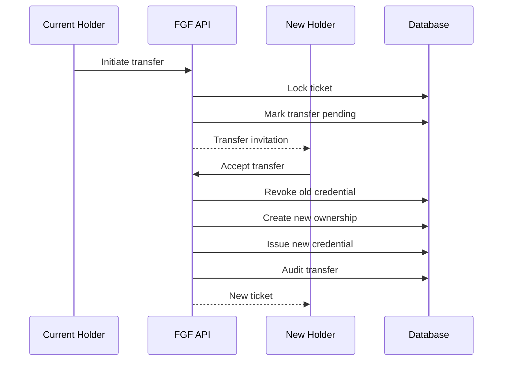

---

# 30. Audit Architecture

Every sensitive event should have:

```text
event_id
timestamp
actor_type
actor_id
device_id
action
resource_type
resource_id
request_id
before_state
after_state
result
reason
ip
metadata
```

Recommended model:

**application can append audit events; ordinary application users cannot delete or edit them.**

For stronger environments, forward security/audit logs to a separately controlled storage system.

---

# 31. Fraud and Abuse Controls

Initial rule set:

### Customer-side

- excessive order attempts
- excessive payment failures
- abnormal ticket reservation rate
- account/device abuse
- transfer abuse

### Ticket-side

- repeated scan attempts
- credential replay
- invalid signature
- revoked credential
- wrong event
- wrong gate
- wrong zone
- suspicious device

### Administrative

- unusual refunds
- unusual price changes
- mass ticket cancellation
- repeated privilege escalation
- unusual manual ticket issuance
- deletion attempts
- configuration changes immediately before events

Do not automatically block users solely because a rule fired. Record the reason and route according to an explicit policy.

---

# 32. API Design

Base path:

`/api/v1`

Example:

```text
GET    /competitions
POST   /competitions

GET    /matches
POST   /matches
GET    /matches/{match_id}

GET    /stadiums
POST   /stadiums

GET    /matches/{match_id}/inventory
POST   /orders
GET    /orders/{order_id}

POST   /payments/{payment_id}/confirm
POST   /payments/webhooks/{provider}

GET    /tickets/{ticket_id}
POST   /tickets/{ticket_id}/transfer

POST   /redemptions
POST   /redemptions/batch

POST   /devices/register
POST   /devices/{device_id}/sync

GET    /reports/revenue
GET    /reports/attendance

GET    /audit/events
```

Every mutation should have:

- authentication
- authorization
- validation
- idempotency where applicable
- structured errors
- request ID
- audit where sensitive

---

# 33. API Idempotency

Use an idempotency key for operations such as:

- create order
- payment confirmation
- ticket issuance
- refund
- transfer
- redemption submission
- offline synchronization batch

Example:

```text
Idempotency-Key: 01JFGF...
```

The database should persist the key and final response/result.

---

# 34. Transactional Outbox

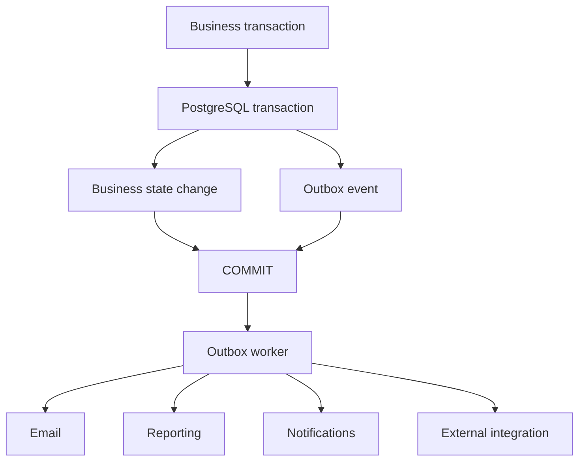

This avoids relying on an external message broker for the correctness of the core transaction.

---

# 35. Observability

Use:

```text
OpenTelemetry
       |
       +--> Prometheus
       +--> Grafana
       +--> Loki
       +--> Tempo
```

Every request should have a correlation/request ID.

Every redemption should be traceable:

```text
customer
 → ticket
 → order
 → payment
 → credential
 → device
 → gate
 → redemption
```

---

# 36. Security Architecture

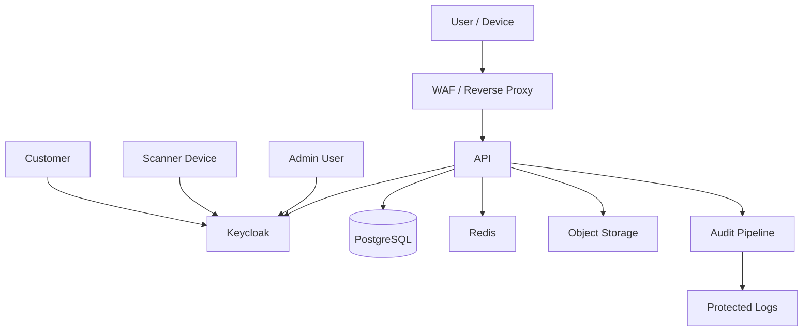

Security layers:

1. TLS
2. WAF/reverse proxy
3. authentication
4. authorization
5. input validation
6. rate limiting
7. database constraints
8. transaction isolation
9. audit
10. secrets management
11. monitoring
12. backups
13. independent security testing

---

# 37. Infrastructure Strategy

## Development

```text
Developer laptop
 ├── Docker Compose
 ├── PostgreSQL
 ├── Redis
 ├── Keycloak
 └── API/Web
```

## Staging

```text
Internet
  ↓
Reverse Proxy
  ↓
API/Web
  ↓
PostgreSQL
  ↓
Redis/Workers
```

## Production

Start small but highly observable:

```text
                  Load Balancer
                       |
               ┌───────┴───────┐
               ▼               ▼
             API 1           API 2
               \               /
                \             /
                 ▼           ▼
                   PostgreSQL
                       |
                     Redis
                       |
                    Workers
```

Scale only after load testing.

---

# 38. Kubernetes Decision

### Not required for V1.

Reasons:

- operational complexity
- larger attack surface
- more infrastructure work
- unnecessary for early scale
- distracts from ticketing correctness

Use containers so Kubernetes remains possible later.

---

# 39. Kafka Decision

### Not required initially.

Use:

- PostgreSQL
- transactional outbox
- Celery
- Redis

Introduce Kafka only if measured throughput or integration requirements justify it.

---

# 40. Open-Source / Vendor Strategy

## Prefer open source

| Capability | Preferred |
|---|---|
| Database | PostgreSQL |
| Identity | Keycloak |
| Backend | FastAPI |
| ORM | SQLAlchemy |
| Web | Next.js |
| Scanner | Flutter |
| Cache | Redis |
| Jobs | Celery |
| Monitoring | Prometheus |
| Dashboards | Grafana |
| Logs | Loki |
| Traces | Tempo |
| Telemetry | OpenTelemetry |
| IaC | OpenTofu |
| Reverse proxy | Caddy/Nginx |

## Use vendors where the business requires them

- payment gateway
- SMS provider
- email delivery
- cloud infrastructure
- domain/DNS
- optional CDN/WAF
- optional KMS/HSM

The architecture must isolate each vendor behind an adapter/interface.

---

# 41. Payment Provider Abstraction

```python
class PaymentProvider:
    def create_payment(self, request): ...
    def verify_payment(self, reference): ...
    def refund(self, request): ...
    def parse_webhook(self, request): ...
```

Then:

```text
PaymentService
      |
      +-- Provider A
      +-- Provider B
      +-- Provider C
```

This avoids locking FGF into one provider.

---

# 42. Scanner Provider Abstraction

The scanner application should abstract the physical scanning layer:

```text
Scanner UI
    |
Scan Engine
    |
+---+---+
|       |
Camera  Hardware Scanner
```

A smartphone camera can be the initial scanner.

Professional hardware can be added later.

---

# 43. Development Roadmap

## Phase 0 — Discovery and architecture

Deliver:

- SRS
- architecture
- threat model
- domain model
- state machines
- ERD
- API contract
- ADRs

## Phase 1 — Platform foundation

- repositories
- CI/CD
- database
- identity
- API
- web foundation
- observability

## Phase 2 — FGF administration

- competitions
- matches
- stadiums
- zones
- seats
- gates
- categories
- prices
- quotas

## Phase 3 — Inventory

- seat reservation
- holds
- expiry
- concurrency
- quotas

## Phase 4 — Checkout/payment

- orders
- payment adapter
- webhook handling
- idempotency
- reconciliation

## Phase 5 — Ticket engine

- issuance
- credential signing
- ticket lifecycle
- cancellation
- refund

## Phase 6 — Online scanner

- Flutter app
- device enrollment
- gate assignment
- online validation
- atomic redemption

## Phase 7 — Offline scanner

- local database
- signed manifests
- offline validation
- scan journal
- synchronization
- conflict handling

## Phase 8 — Reporting/finance

- revenue
- attendance
- reconciliation
- exports
- dashboards

## Phase 9 — Security hardening

- threat-model review
- automated security tests
- load testing
- penetration testing
- backup restore testing

## Phase 10 — Pilot

- limited match
- limited gates
- real payment
- real scanners
- controlled audience
- incident review

## Phase 11 — Production

- operational runbook
- match-day support
- SLA
- monitoring
- DR
- final acceptance

---

# 44. Testing Strategy

## Unit tests

Business rules:

- ticket states
- inventory
- payment
- redemption
- transfers
- quotas

## Integration tests

- PostgreSQL
- Keycloak
- payment sandbox
- Redis
- object storage

## Contract tests

Payment provider webhooks and external APIs.

## Concurrency tests

Especially:

- two users purchasing one seat
- two scanners scanning one ticket
- simultaneous refund and entry
- simultaneous transfer and entry

## Offline tests

- device loses connection
- duplicate scan
- device clock incorrect
- sync interruption
- partial sync
- conflict
- device revoked while offline

## Load tests

Use k6.

Test:

- ticket-sale opening
- checkout spikes
- scan spikes
- dashboard load

---

# 45. Critical Acceptance Tests

The system should not be accepted until these scenarios pass.

### AT-001 — Duplicate online scan

```text
Ticket X
Scanner A → accepted
Scanner B → rejected
```

### AT-002 — Simultaneous scan

```text
Scanner A ─┐
           ├── same ticket
Scanner B ─┘

Exactly one successful redemption.
```

### AT-003 — Payment retry

```text
same webhook × 5
        ↓
one payment
one ticket
```

### AT-004 — Refund

```text
paid ticket
 ↓
refund
 ↓
ticket invalid
 ↓
gate rejects
```

### AT-005 — Transfer

```text
old credential → invalid
new credential → valid
```

### AT-006 — Offline

```text
device loses Internet
 ↓
valid provisioned ticket
 ↓
scanner still works
 ↓
reconnect
 ↓
scan journal synchronizes
```

### AT-007 — Revoked device

```text
device stolen
 ↓
admin revokes device
 ↓
device cannot synchronize/use protected operations
```

---

# 46. Operational Match-Day Flow

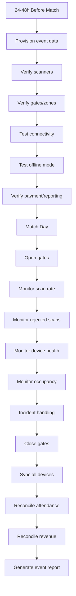

---

# 47. Match-Day Incident Categories

### P0 — Critical

- central ticket validation unavailable
- payment corruption
- mass invalidation
- security breach

### P1 — Major

- gate scanner fleet unavailable
- synchronization failure
- severe payment failure

### P2 — Operational

- individual scanner failure
- individual customer ticket problem
- isolated payment issue

Every incident needs:

- owner
- timestamp
- impact
- mitigation
- resolution
- post-event review

---

# 48. Data Protection

The platform will handle customer identity and payment-related information.

The final production design should therefore be reviewed by legal/compliance specialists for the actual jurisdictions and payment arrangements involved.

Engineering principles:

- data minimization
- purpose limitation
- encryption
- retention policy
- deletion/anonymization workflow
- access control
- audit
- processor/vendor contracts
- incident response

Do not store payment-card data if the selected payment architecture allows tokenized/hosted payment processing.

---

# 49. Ownership / Vendor Independence

FGF should control:

- source repository
- production cloud accounts
- DNS
- database
- encryption/key-management accounts where appropriate
- monitoring
- backups
- domain
- payment accounts
- documentation

The development vendor should not be the sole holder of production credentials.

---

# 50. Documentation Set

The project should maintain:

```text
docs/
├── 01-product/
│   ├── project-charter.md
│   ├── scope.md
│   └── stakeholder-register.md
│
├── 02-requirements/
│   ├── SRS.md
│   ├── functional-requirements.md
│   ├── non-functional-requirements.md
│   └── acceptance-criteria.md
│
├── 03-domain/
│   ├── domain-model.md
│   ├── ticket-state-machine.md
│   ├── payment-state-machine.md
│   └── redemption-state-machine.md
│
├── 04-architecture/
│   ├── system-architecture.md
│   ├── deployment-architecture.md
│   ├── database-architecture.md
│   └── integration-architecture.md
│
├── 05-security/
│   ├── threat-model.md
│   ├── security-architecture.md
│   ├── key-management.md
│   └── security-test-plan.md
│
├── 06-api/
│   ├── openapi.yaml
│   └── api-guidelines.md
│
├── 07-offline/
│   ├── offline-architecture.md
│   ├── synchronization.md
│   └── conflict-resolution.md
│
├── 08-operations/
│   ├── deployment.md
│   ├── monitoring.md
│   ├── backup-restore.md
│   ├── disaster-recovery.md
│   └── match-day-runbook.md
│
├── 09-testing/
│   ├── test-strategy.md
│   ├── performance-plan.md
│   └── security-plan.md
│
└── 10-adr/
    ├── ADR-001-modular-monolith.md
    ├── ADR-002-postgresql.md
    ├── ADR-003-keycloak.md
    ├── ADR-004-dynamic-credentials.md
    ├── ADR-005-offline-validation.md
    └── ADR-006-no-kubernetes-v1.md
```

---

# 51. Architecture Decision Records

## ADR-001 — Modular Monolith

**Decision:** Use a modular monolith for V1.

**Reason:** Solo development, transactional consistency, simpler operations and lower infrastructure complexity.

**Future:** Extract services only after measured need.

## ADR-002 — PostgreSQL

**Decision:** PostgreSQL is the system of record.

**Reason:** ticket inventory, payment, redemption and financial state require strong relational consistency.

## ADR-003 — Keycloak

**Decision:** Use Keycloak rather than building authentication from scratch.

**Reason:** reduces security-sensitive custom code while retaining open protocols.

## ADR-004 — Dynamic Credentials

**Decision:** Support signed static credentials and dynamic mobile credentials.

**Reason:** different event/security requirements require different delivery modes.

## ADR-005 — Offline

**Decision:** Offline scanning is a separately specified subsystem.

**Reason:** disconnected devices cannot observe global redemption state in real time.

## ADR-006 — No Kubernetes V1

**Decision:** Containerize but do not require Kubernetes initially.

**Reason:** complexity is not justified before actual scale is measured.

---

# 52. Recommended V1 Scope

## Must-have

- FGF admin
- competitions
- matches
- stadiums
- zones
- seats
- ticket categories
- pricing
- quotas
- customer web
- orders
- payment integration
- secure ticket issuance
- QR credential
- scanner application
- online redemption
- audit
- reports
- financial reconciliation
- monitoring
- backups

## V1.5

- offline scanner
- dynamic mobile credentials
- transfer
- refunds automation
- physical POS

## V2

- advanced resale
- multiple payment providers
- multiple stadiums at scale
- advanced analytics
- mobile wallet integrations
- automated accounting integrations
- advanced fraud analytics

---

# 53. What Should NOT Be Built First

Do not start with:

- microservices
- Kubernetes
- Kafka
- AI fraud detection
- complex resale marketplace
- native iOS + native Android separately
- custom cryptography
- custom identity provider
- custom payment processing
- custom hardware

First prove:

**Sell → Pay → Issue → Scan → Redeem → Report.**

---

# 54. End-to-End Implementation Flow

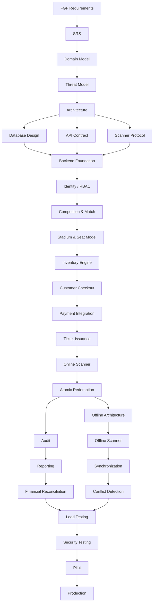

---

# 55. Final Technical Position

The recommended platform is:

```text
                     FGF
                      |
          ┌───────────┴───────────┐
          |                       |
      Customer                 Admin
        Web                     Web
          |                       |
          └───────────┬───────────┘
                      |
                 Next.js Web
                      |
                  FastAPI API
                      |
        ┌─────────────┼─────────────┐
        |             |             |
     Keycloak      PostgreSQL     Redis
        |                           |
        |                         Celery
        |                           |
        └─────────────┬─────────────┘
                      |
             Ticket / Redemption
                      |
                 Flutter Scanner
                      |
           ┌──────────┴──────────┐
           |                     |
        Online                 Offline
           |                     |
      PostgreSQL             SQLite
           |                     |
           └──────────┬──────────┘
                      |
                  Synchronize
                      |
                  Audit/Reports
```

This architecture gives FGF a platform that is:

- federation-controlled
- API-first
- open-source-heavy
- modular
- testable
- auditable
- scalable
- suitable for multiple stadiums
- capable of mobile ticketing
- capable of offline gate operations
- designed for payment-provider independence
- designed for hardware-provider independence
- realistic for a strong solo technical lead with specialist support

---

# 56. External Research References

The following were used as industry/architecture references, not as requirements that must be copied:

1. Ticketmaster SafeTix — rotating/encrypted mobile ticket credentials and secure entry integration.
2. AXS Mobile ID — revolving QR/mobile ID, app-based ticket presentation and offline/event-day availability.
3. UEFA Mobile Tickets — app-based ticket delivery and match-day mobile-ticket workflow.
4. pretix — open-source ticketing platform, REST API, device authentication, check-in and offline scanning concepts.
5. Eventyay — open-source event platform demonstrating unified event/ticketing architecture, permissions, APIs, payment services, audit/logging and asynchronous processing.

The FGF-specific requirements remain authoritative; these external systems are used only to identify proven architectural patterns.

---

# 57. Recommended Next Engineering Artifacts

Before implementation begins, create these five artifacts:

1. **SRS v1.0** — every requirement assigned an ID and acceptance criterion.
2. **Architecture Specification v1.0** — modules, deployment, integrations and trust boundaries.
3. **Database/ERD v1.0** — complete PostgreSQL schema.
4. **Security & Threat Model v1.0** — attack surfaces, mitigations and security assumptions.
5. **API Contract v1.0** — OpenAPI specification.

Only after these are reviewed should implementation begin.

---

## Core engineering principle

> The QR code is not the ticketing security system.

> The platform is the security system.

The QR/dynamic credential is only the mechanism by which the scanner obtains a verifiable ticket credential. Authenticity, payment state, event/zone authorization, redemption state, device identity, synchronization, auditability and operational controls together provide the security model.

That principle should remain central throughout the implementation.
